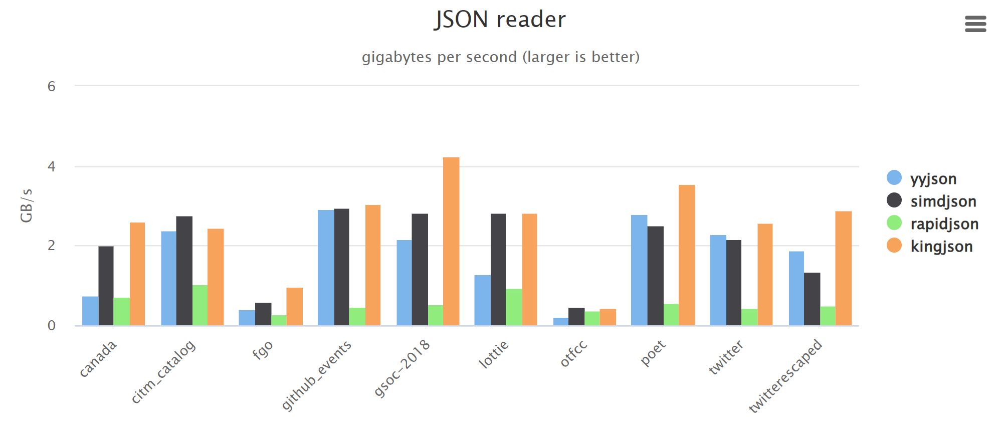
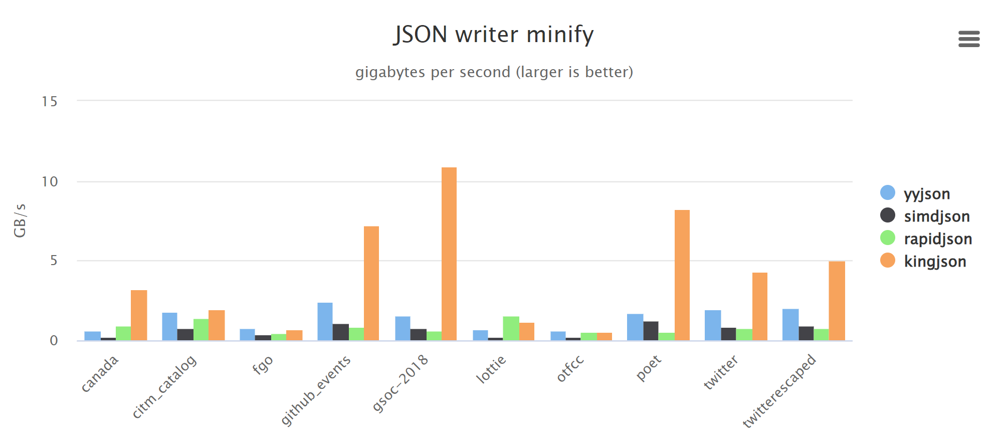

# Introduction
There are two json parser class. 

The bang json is very very simple,  it only has 154 lines code.

The king json is very fast and powerful tool to parse, modify, export json data. The performance is better than yysjon and simdjson.

# Performance
Benchmark project and dataset: [yyjson_benchmark](https://github.com/ibireme/yyjson_benchmark)

#### json data reader

#### json data writer

# Sample Code
### parse 
1. CKingJson kingJson;
2. kingJson.OpenFileA("d:/data/data.json", 0);
3. kingJson.ParseData("{...}", 1023, 0);
4. const char * pValue = kingJson.GetValue(NULL, "name", NULL);

### create 
1. CKingJson kingJson;
2. PKSONNODE pNode = kingJson.AddNode(NULL, "product", false);
3. PKSONITEM pItem = kingJson.AddItem(pNode, "value", 1234);

### modify 
1. CKingJson kingJson;
2. kingJson.OpenFileA("d:/data/data.json", 0);
3. PKSONNODE pNode = kingJson.AddNode(NULL, "product", false);
4. kingJson.DelItem(pNode, "value");
5. kingJson.ModItem(pNode, "value", 1234);

### export 
1. create json format string.
2. int nSize = 0;
3. const char * pText = kingJson.FormatTxt(NULL, &nSize);
4. kingJson.SaveToFile(NULL, "d:/temp/data.json");
   